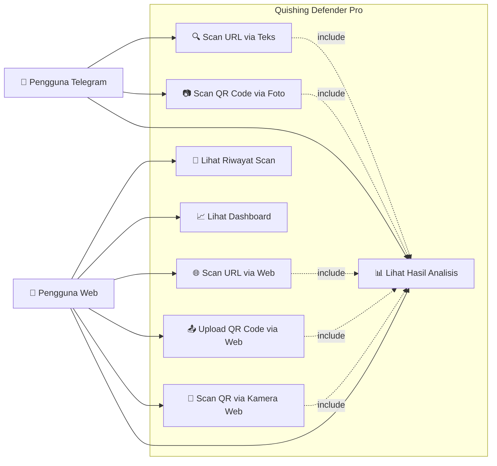
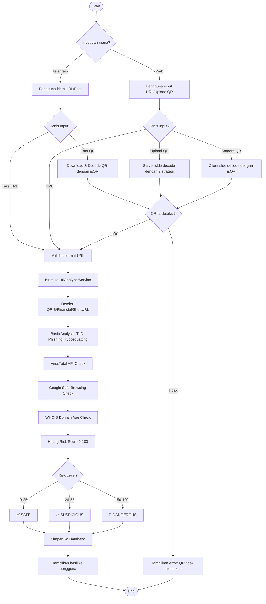
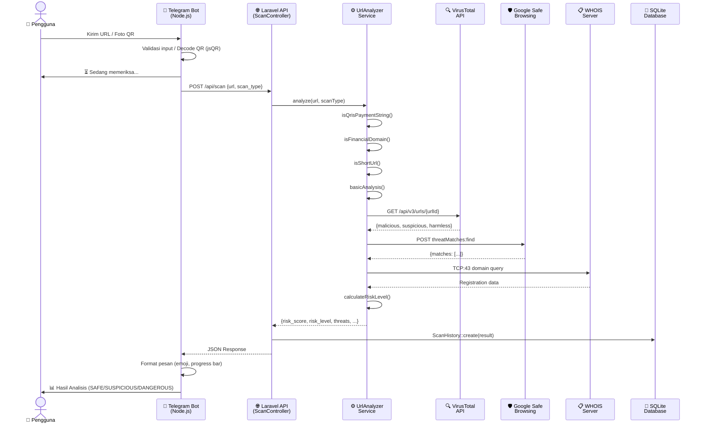
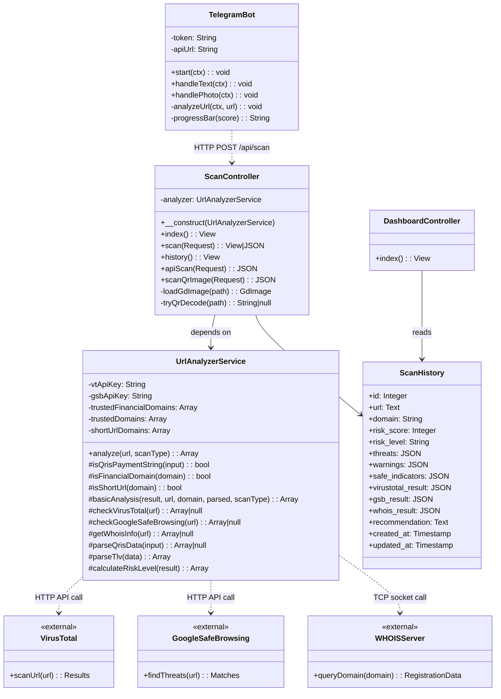
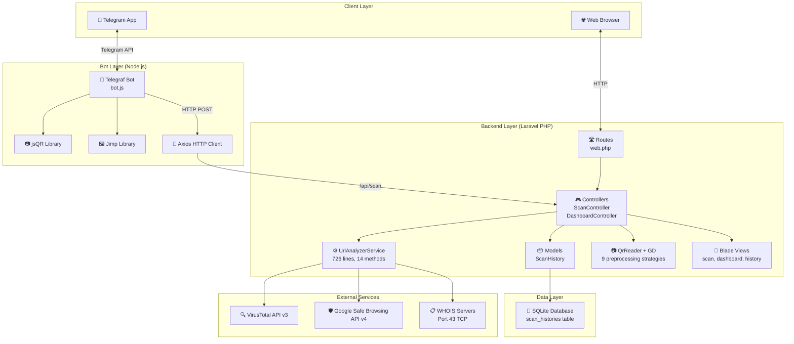
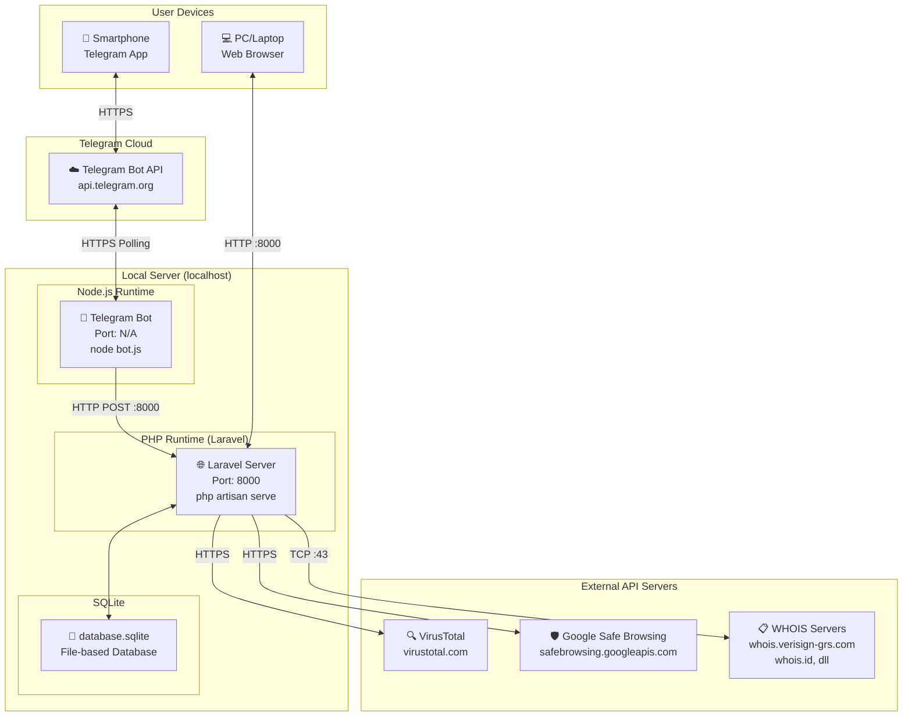

<p align="center">
  
</p>

<h1 align="center">🛡️ QUISHING DEFENDER PRO</h1>
<h3 align="center">Sistem Deteksi dan Pencegahan Serangan Quishing Berbasis Telegram Bot</h3>

<p align="center">
  
  
  
  
  
</p>

---

## 📑 DAFTAR ISI

| No. | Bab | Deskripsi |
|-----|-----|-----------|
| 1 | [Pendahuluan](#bab-1-pendahuluan) | Latar belakang, rumusan masalah, tujuan, dan manfaat penelitian |
| 2 | [Tinjauan Pustaka](#bab-2-tinjauan-pustaka) | Landasan teori dan referensi ilmiah |
| 3 | [Metodologi Penelitian](#bab-3-metodologi-penelitian) | Metode pengembangan, arsitektur, dan teknologi |
| 4 | [Hasil dan Pembahasan](#bab-4-hasil-dan-pembahasan) | Implementasi sistem dan analisis fitur |
| 5 | [Diagram UML](#bab-5-diagram-uml) | Use Case, Activity, Sequence, Class, Component, dan Deployment Diagram |
| 6 | [Kesimpulan dan Saran](#bab-6-kesimpulan-dan-saran) | Ringkasan hasil dan rekomendasi pengembangan |
| 7 | [Daftar Pustaka](#daftar-pustaka) | Referensi ilmiah yang digunakan |

---

## BAB 1: PENDAHULUAN

### 1.1 Latar Belakang

Perkembangan teknologi informasi yang pesat telah membawa perubahan signifikan dalam berbagai aspek kehidupan masyarakat. Salah satu teknologi yang mengalami adopsi masif adalah QR Code (*Quick Response Code*). QR Code, yang pertama kali dikembangkan oleh Denso Wave pada tahun 1994, telah menjadi media pertukaran informasi yang sangat populer karena kemudahan penggunaannya (Durak, Ozkeskin, & Ataizi, 2016). Di Indonesia, penggunaan QR Code semakin meningkat seiring dengan implementasi QRIS (*Quick Response Code Indonesian Standard*) sebagai standar pembayaran digital nasional yang diluncurkan oleh Bank Indonesia.

QR Code digunakan secara luas dalam berbagai sektor, mulai dari pendidikan (Law & So, 2010), *food traceability* (Kim & Woo, 2016), hingga sistem keamanan otomatis (Salam & Bhaskoro, 2021). Namun, di balik kemudahan tersebut, terdapat ancaman keamanan yang serius. Penjahat siber memanfaatkan QR Code sebagai vektor serangan baru yang dikenal sebagai **Quishing** (*QR Code Phishing*) — yaitu teknik *phishing* yang menggunakan QR Code palsu untuk mengarahkan korban ke situs web berbahaya (Amoah & JB, 2022).

Serangan quishing menjadi semakin berbahaya karena beberapa faktor: (1) pengguna tidak dapat melihat URL tujuan sebelum memindai QR Code, (2) QR Code dapat dengan mudah dibuat dan dicetak oleh siapa saja, dan (3) peningkatan penggunaan pembayaran digital melalui QRIS membuat pengguna terbiasa memindai QR Code tanpa verifikasi (Akram et al., 2026). Dalam konteks Indonesia, di mana kesadaran keamanan siber masih relatif rendah (Gulo, Lasmadi, & Nawawi, 2021), ancaman quishing menjadi permasalahan yang sangat relevan.

Menurut Susanto et al. (2023), manajemen keamanan siber di era digital memerlukan pendekatan proaktif yang melibatkan teknologi deteksi otomatis. Oleh karena itu, diperlukan sebuah sistem yang dapat membantu pengguna dalam mendeteksi dan mencegah serangan quishing secara *real-time*. Telegram Bot dipilih sebagai platform karena kemudahan akses, tidak memerlukan instalasi aplikasi tambahan, dan memiliki API yang kaya fitur untuk pengembangan bot otomatis.

### 1.2 Rumusan Masalah

Berdasarkan latar belakang di atas, rumusan masalah yang diangkat dalam penelitian ini adalah:

1. Bagaimana merancang dan membangun sistem deteksi serangan quishing yang mampu menganalisis URL dan QR Code secara otomatis?
2. Bagaimana mengintegrasikan layanan keamanan pihak ketiga (VirusTotal, Google Safe Browsing, WHOIS) untuk meningkatkan akurasi deteksi ancaman?
3. Bagaimana mengimplementasikan sistem yang dapat mendeteksi berbagai jenis ancaman termasuk *phishing*, *typosquatting*, domain mencurigakan, dan kode QRIS palsu?
4. Bagaimana menyajikan hasil analisis keamanan secara informatif dan mudah dipahami oleh pengguna melalui Telegram Bot dan antarmuka web?

### 1.3 Tujuan Penelitian

Tujuan dari penelitian ini adalah:

1. **Membangun Telegram Bot** yang mampu menerima input berupa URL teks dan gambar QR Code, lalu menganalisis tingkat keamanannya secara otomatis.
2. **Mengembangkan *backend* analisis keamanan** menggunakan framework Laravel yang mengintegrasikan API VirusTotal, Google Safe Browsing, dan protokol WHOIS.
3. **Mengimplementasikan sistem skoring risiko** (*risk scoring*) yang dapat mengklasifikasikan URL ke dalam tiga kategori: SAFE, SUSPICIOUS, dan DANGEROUS.
4. **Menyediakan antarmuka web** (*dashboard*) untuk memantau statistik pemindaian dan riwayat analisis.
5. **Mendeteksi transaksi keuangan** (QRIS/EMV QR Payment) dan memberikan informasi verifikasi merchant.

### 1.4 Manfaat Penelitian

**Manfaat Akademis:**
- Berkontribusi pada penelitian keamanan siber khususnya di bidang deteksi *phishing* berbasis QR Code.
- Menjadi referensi pengembangan sistem keamanan yang menggabungkan *multi-layer analysis*.

**Manfaat Praktis:**
- Membantu pengguna awam dalam memverifikasi keamanan URL dan QR Code sebelum mengaksesnya.
- Mengurangi risiko kerugian finansial akibat serangan quishing, terutama melalui QRIS palsu.
- Menyediakan *tool* keamanan yang mudah diakses melalui platform Telegram yang sudah familiar bagi pengguna.

### 1.5 Batasan Masalah

1. Sistem ini fokus pada deteksi ancaman berbasis URL dan QR Code, tidak mencakup deteksi malware pada file.
2. Analisis QR Code terbatas pada format QR Code standar dan QRIS (EMV QR).
3. Akurasi deteksi bergantung pada ketersediaan dan respons dari API pihak ketiga (VirusTotal dan Google Safe Browsing).
4. Sistem ini berjalan pada lingkungan lokal (*localhost*) dan memerlukan koneksi internet untuk mengakses API eksternal.

---

## BAB 2: TINJAUAN PUSTAKA

### 2.1 QR Code (*Quick Response Code*)

QR Code adalah jenis kode matriks dua dimensi (*2D barcode*) yang pertama kali dikembangkan oleh Denso Wave, anak perusahaan Toyota, pada tahun 1994. Berbeda dengan barcode konvensional yang hanya menyimpan informasi secara horizontal, QR Code menyimpan informasi baik secara horizontal maupun vertikal, sehingga mampu menampung data yang jauh lebih besar (Garateguy et al., 2014).

Menurut Durak, Ozkeskin, dan Ataizi (2016), QR Code memiliki beberapa keunggulan:
- **Kapasitas penyimpanan tinggi**: hingga 7.089 karakter numerik atau 4.296 karakter alfanumerik.
- **Pemindaian cepat**: dapat dipindai dalam hitungan milidetik menggunakan kamera *smartphone*.
- **Koreksi kesalahan (*error correction*)**: tetap dapat dibaca meskipun sebagian kode rusak.
- **Ukuran fleksibel**: dapat dicetak dalam berbagai ukuran tanpa kehilangan fungsionalitas.

Law dan So (2010) menyatakan bahwa QR Code telah banyak digunakan dalam bidang pendidikan sebagai media pengayaan konten pembelajaran. Sementara Kim dan Woo (2016) meneliti penerapan QR Code dalam sistem *food traceability* dan menemukan bahwa penerimaan pengguna terhadap teknologi ini dipengaruhi oleh persepsi kemudahan penggunaan dan kegunaan (*Technology Acceptance Model*).

### 2.2 QRIS (*Quick Response Code Indonesian Standard*)

QRIS adalah standar nasional QR Code untuk pembayaran digital di Indonesia yang diluncurkan oleh Bank Indonesia pada 1 Januari 2020. QRIS mengadopsi format **EMV QR Code** (*Europay, Mastercard, and Visa*) yang menggunakan struktur data **TLV** (*Tag-Length-Value*) untuk menyimpan informasi transaksi seperti nama merchant, kota, kode negara, dan nominal transaksi (Salam & Bhaskoro, 2021).

### 2.3 Quishing (*QR Code Phishing*)

Quishing merupakan teknik serangan *social engineering* yang memanfaatkan QR Code untuk mengarahkan korban ke situs web palsu (Amoah & JB, 2022). Menurut Akram et al. (2026), serangan quishing dapat dilakukan melalui:
- **QR Code palsu yang ditempel** di atas QR Code asli pada tempat umum.
- **QR Code dalam email atau dokumen** yang mengarahkan ke halaman login palsu.
- **QRIS palsu** yang mengarahkan pembayaran ke rekening penipu.
- **Fancy QR codes** dengan desain kompleks yang menyulitkan identifikasi keaslian.

Amoah dan JB (2022) mengusulkan beberapa strategi mitigasi quishing:
1. Verifikasi URL sebelum mengakses.
2. Penggunaan *QR code scanner* yang dilengkapi fitur keamanan.
3. Edukasi pengguna tentang risiko QR Code.
4. Implementasi *safe browsing* checks.

### 2.4 Keamanan Siber di Indonesia

Gulo, Lasmadi, dan Nawawi (2021) membahas bagaimana kejahatan siber dalam bentuk *phishing* telah diatur dalam Undang-Undang Informasi dan Transaksi Elektronik (UU ITE) di Indonesia. Meskipun regulasi sudah ada, implementasi pencegahan masih memerlukan peningkatan, terutama dari sisi teknologi deteksi otomatis.

Susanto et al. (2023) menekankan pentingnya manajemen keamanan siber di era digital yang mencakup: identifikasi ancaman, proteksi sistem, deteksi serangan, respons insiden, dan pemulihan. Penelitian ini sejalan dengan pengembangan Quishing Defender yang berfokus pada aspek deteksi dan proteksi.

### 2.5 Teknologi yang Digunakan

| Teknologi | Fungsi | Keterangan |
|-----------|--------|------------|
| **Laravel 12** | Backend API & Web | Framework PHP untuk analisis URL dan manajemen data |
| **Node.js + Telegraf** | Telegram Bot | Library untuk membangun bot Telegram |
| **VirusTotal API v3** | Deteksi Malware | Memindai URL dengan 70+ engine antivirus |
| **Google Safe Browsing API v4** | Deteksi Phishing | Database ancaman web dari Google |
| **WHOIS Protocol** | Usia Domain | Cek registrasi dan usia domain |
| **jsQR & QrReader** | Dekoding QR Code | Library pembaca QR Code dari gambar |
| **Jimp** | Pemrosesan Gambar | Manipulasi gambar untuk bot Telegram |
| **SQLite** | Database | Penyimpanan riwayat scan |
| **GD Library (PHP)** | Image Preprocessing | 9 strategi preprocessing untuk dekoding QR yang sulit |

---

## BAB 3: METODOLOGI PENELITIAN

### 3.1 Metode Pengembangan

Penelitian ini menggunakan metode **Prototyping** dalam pengembangan perangkat lunak. Metode ini dipilih karena sesuai dengan kebutuhan pengembangan sistem yang memerlukan iterasi cepat dan validasi fitur secara bertahap.

Tahapan pengembangan meliputi:

1. **Analisis Kebutuhan**: Identifikasi fitur-fitur yang diperlukan berdasarkan studi literatur tentang serangan quishing.
2. **Perancangan Sistem**: Merancang arsitektur sistem, *database schema*, dan alur kerja (*workflow*).
3. **Implementasi**: Pengembangan *backend* (Laravel), Telegram Bot (Node.js), dan antarmuka web.
4. **Pengujian**: Pengujian fungsional terhadap berbagai jenis URL dan QR Code.
5. **Evaluasi dan Perbaikan**: Iterasi berdasarkan hasil pengujian.

### 3.2 Arsitektur Sistem

Sistem Quishing Defender Pro menggunakan arsitektur **client-server** dengan tiga komponen utama:

```
┌─────────────────────────────────────────────────────────────────────┐
│                    ARSITEKTUR QUISHING DEFENDER PRO                  │
├─────────────────────────────────────────────────────────────────────┤
│                                                                     │
│   ┌──────────────┐    HTTP/API     ┌──────────────────────────┐    │
│   │  Telegram     │───────────────▶│                          │    │
│   │  Bot (Node.js)│◀───────────────│   Laravel Backend        │    │
│   └──────────────┘    JSON         │   (PHP 8.2+)             │    │
│                                    │                          │    │
│   ┌──────────────┐    HTTP/API     │  ┌────────────────────┐  │    │
│   │  Web Browser  │───────────────▶│  │UrlAnalyzerService  │  │    │
│   │  (Frontend)   │◀───────────────│  │  • VirusTotal      │  │    │
│   └──────────────┘    HTML/JSON    │  │  • Safe Browsing   │  │    │
│                                    │  │  • WHOIS Lookup    │  │    │
│                                    │  │  • Basic Analysis  │  │    │
│                                    │  │  • QRIS Parser     │  │    │
│                                    │  └────────────────────┘  │    │
│                                    │                          │    │
│                                    │  ┌────────────────────┐  │    │
│                                    │  │ SQLite Database     │  │    │
│                                    │  │  • scan_histories   │  │    │
│                                    │  └────────────────────┘  │    │
│                                    └──────────────────────────┘    │
│                                           │                        │
│                                    ┌──────┴──────┐                 │
│                                    │ External API │                 │
│                                    │ • VirusTotal │                 │
│                                    │ • Google SB  │                 │
│                                    │ • WHOIS      │                 │
│                                    └─────────────┘                 │
└─────────────────────────────────────────────────────────────────────┘
```

### 3.3 Struktur Direktori Proyek

```
Project UAS/
├── telegram_bot/                  # Telegram Bot (Node.js)
│   ├── bot.js                     # Logic utama bot (203 baris)
│   ├── package.json               # Dependencies (telegraf, axios, jsqr, jimp)
│   └── .env                       # Konfigurasi token dan API key
│
├── quishing-laravel/              # Backend & Web (Laravel 12)
│   ├── app/
│   │   ├── Http/Controllers/
│   │   │   ├── ScanController.php       # Controller scan URL & QR (258 baris)
│   │   │   └── DashboardController.php  # Controller dashboard statistik
│   │   ├── Models/
│   │   │   └── ScanHistory.php          # Model riwayat scan
│   │   └── Services/
│   │       └── UrlAnalyzerService.php   # Service analisis URL (726 baris)
│   ├── database/
│   │   └── migrations/
│   │       └── create_scan_histories_table.php
│   ├── resources/views/
│   │   ├── scan/                  # Views: index, result, history
│   │   ├── dashboard/             # View: dashboard statistik
│   │   └── layouts/               # Layout templates
│   └── routes/
│       └── web.php                # Definisi routes
│
├── _legacy/                       # Versi lama (Node.js Express)
│   ├── server.js                  # Server Express (referensi)
│   └── services/                  # Service lama
│
└── start-app.bat                  # Control Panel launcher
```

### 3.4 Alur Kerja Sistem

#### 3.4.1 Alur Pemindaian URL (via Telegram Bot)

1. Pengguna mengirim URL teks ke Telegram Bot.
2. Bot memvalidasi format URL menggunakan *regex pattern*.
3. Bot mengirim URL ke Laravel API endpoint (`/api/scan`).
4. `UrlAnalyzerService` melakukan analisis multi-layer:
   - **Deteksi otomatis**: cek QRIS, domain keuangan, *short URL*.
   - **Analisis dasar**: TLD mencurigakan, pola *phishing*, *typosquatting*, IP address.
   - **VirusTotal**: scan dengan 70+ engine antivirus.
   - **Google Safe Browsing**: cek database ancaman Google.
   - **WHOIS**: cek usia registrasi domain.
5. Sistem menghitung *risk score* (0-100) dan klasifikasi (`SAFE`/`SUSPICIOUS`/`DANGEROUS`).
6. Hasil dikirim kembali ke bot dan ditampilkan ke pengguna.

#### 3.4.2 Alur Pemindaian QR Code (via Telegram Bot)

1. Pengguna mengirim foto QR Code ke Telegram Bot.
2. Bot mengunduh gambar resolusi tertinggi melalui Telegram API.
3. Bot menggunakan **Jimp** untuk membaca *bitmap* gambar.
4. Bot menggunakan **jsQR** untuk mendekode QR Code dari data pixel.
5. Jika QR Code terdeteksi, URL hasil dekode dikirim ke Laravel API.
6. Proses analisis sama dengan pemindaian URL.

#### 3.4.3 Alur Pemindaian QR Code (via Web — Server-Side Fallback)

1. Pengguna mengunggah gambar QR Code melalui antarmuka web.
2. `ScanController::scanQrImage()` menerima gambar.
3. Sistem mencoba dekode langsung menggunakan `QrReader`.
4. Jika gagal, sistem menerapkan **9 strategi preprocessing** secara berurutan:
   - Grayscale
   - Grayscale + Contrast
   - Grayscale + Contrast High
   - Grayscale + Sharpen
   - Grayscale + Brightness Up
   - Grayscale + Brightness Down
   - Upscale 2x + Grayscale + Contrast
   - Negate
   - Edge Detect + Contrast
5. Setiap strategi menghasilkan gambar yang diproses, lalu dicoba dekode ulang.
6. Strategi pertama yang berhasil digunakan sebagai hasil.

---

## BAB 4: HASIL DAN PEMBAHASAN

### 4.1 Implementasi Telegram Bot

Bot Telegram dibangun menggunakan **Telegraf** (Node.js) dan mendukung dua jenis input:

#### 4.1.1 Handler Pesan Teks (URL)

```javascript
bot.on('text', async (ctx) => {
    const text = ctx.message.text;
    const urlPattern = /^(https?:\/\/)?([\\da-z\\.-]+)\\.([a-z\\.]{2,6})([\/\\w \\.-]*)*\/?$/;
    if (urlPattern.test(text)) {
        await analyzeUrl(ctx, text);
    } else {
        ctx.reply("⚠️ Itu sepertinya bukan URL yang valid.");
    }
});
```

Bot memvalidasi input menggunakan *regex* sebelum mengirim ke API backend.

#### 4.1.2 Handler Foto (QR Code)

```javascript
bot.on('photo', async (ctx) => {
    const photos = ctx.message.photo;
    const fileId = photos[photos.length - 1].file_id; // Resolusi tertinggi
    const fileLink = await ctx.telegram.getFileLink(fileId);
    const image = await Jimp.read(fileLink.href);
    const { data, width, height } = image.bitmap;
    const code = jsQR(data, width, height);
    if (code) {
        await analyzeUrl(ctx, code.data);
    }
});
```

Bot mengambil foto resolusi tertinggi dari array `ctx.message.photo`, memproses menggunakan **Jimp** untuk mendapatkan data pixel, dan mendekode QR Code menggunakan **jsQR**.

### 4.2 Implementasi Backend (Laravel)

#### 4.2.1 UrlAnalyzerService — Multi-Layer Analysis

Service utama (`UrlAnalyzerService.php`, 726 baris) menjalankan **5 lapisan analisis**:

| Layer | Metode | Deskripsi |
|-------|--------|-----------|
| 1 | `isQrisPaymentString()` | Deteksi format QRIS/EMV (awalan `000201`) |
| 2 | `basicAnalysis()` | Analisis TLD, phishing pattern, typosquatting, IP, HTTPS |
| 3 | `checkVirusTotal()` | Scan via VirusTotal API v3 (70+ engine antivirus) |
| 4 | `checkGoogleSafeBrowsing()` | Cek Google Safe Browsing API v4 |
| 5 | `getWhoisInfo()` | Cek usia domain via WHOIS protocol |

#### 4.2.2 Deteksi Typosquatting

Sistem mendeteksi 11 pola typosquatting untuk domain populer:

```php
$typosquatPatterns = [
    ['pattern' => '/g[0o]{2}gle|go0gle|googl[^e]|goog1e/i', 'real' => 'google.com'],
    ['pattern' => '/faceb[0o]{2}k|facebo0k|facebok/i',       'real' => 'facebook.com'],
    ['pattern' => '/paypa[l1i]|payp[a4]l|paypai/i',          'real' => 'paypal.com'],
    ['pattern' => '/br[i1l]\.co\.id|brl\.co\.id/i',          'real' => 'bri.co.id'],
    // ... dan lainnya
];
```

#### 4.2.3 Sistem Skoring Risiko

Sistem menggunakan *risk score* kumulatif (0-100):

| Faktor | Penambahan Skor |
|--------|----------------|
| VirusTotal: engine mendeteksi malicious | +10 per engine (maks +50) |
| Google Safe Browsing: terdeteksi berbahaya | +40 |
| Pola phishing terdeteksi | +40 |
| Typosquatting terdeteksi | +50 |
| Karakter @ dalam URL (redirect trick) | +35 |
| TLD mencurigakan (.tk, .ml, .xyz, dll) | +25 |
| Domain baru (<30 hari) | +25 |
| IP address sebagai host | +20 |
| Tidak menggunakan HTTPS | +15 |
| Terlalu banyak subdomain | +15 |
| URL terlalu panjang | +10 |
| Domain terpercaya | -20 |
| Domain keuangan terpercaya | -25 |

**Klasifikasi:**
- **SAFE** (0-25): URL aman, tetap waspada.
- **SUSPICIOUS** (26-55): URL mencurigakan, jangan masukkan data pribadi.
- **DANGEROUS** (56-100): URL berbahaya, jangan buka.

#### 4.2.4 Parser QRIS/EMV

Sistem mampu mem-*parsing* data QRIS menggunakan format TLV dan mengekstrak informasi: nama merchant (Tag 59), kota (Tag 60), kode negara (Tag 58), nominal transaksi (Tag 54), dan informasi *acquirer* (Tag 26-51).

### 4.3 Implementasi Web Interface

#### 4.3.1 Halaman Scan (`/scan`)

Halaman utama memungkinkan pengguna memasukkan URL secara manual atau mengunggah gambar QR Code. Fitur:
- Input URL dengan pilihan protokol (HTTP/HTTPS/Auto).
- Upload gambar QR Code dengan *drag-and-drop*.
- Pemindaian QR Code menggunakan kamera perangkat.
- Riwayat 10 scan terbaru.

#### 4.3.2 Halaman Hasil (`/scan` POST)

Menampilkan hasil analisis lengkap termasuk: *risk score* dengan progress bar visual, daftar ancaman dengan tingkat keparahan, peringatan, indikator aman, hasil VirusTotal, Google Safe Browsing, dan WHOIS.

#### 4.3.3 Dashboard (`/dashboard`)

Menampilkan statistik pemindaian: total scan, jumlah URL aman/mencurigakan/berbahaya, 10 scan terbaru, dan grafik statistik harian.

#### 4.3.4 Riwayat Scan (`/history`)

Menampilkan seluruh riwayat pemindaian dengan paginasi (20 per halaman).

### 4.4 Fitur Keamanan Utama

| No | Fitur | Implementasi |
|----|-------|-------------|
| 1 | Deteksi Phishing | Pattern matching URL + VirusTotal + Google SB |
| 2 | Deteksi Typosquatting | 11 regex pattern domain populer |
| 3 | Verifikasi Domain | Daftar 30+ domain keuangan Indonesia terpercaya |
| 4 | Deteksi Short URL | Daftar 25+ domain URL shortener |
| 5 | Analisis Usia Domain | WHOIS protocol lookup |
| 6 | Dekode QRIS | EMV TLV parser untuk verifikasi merchant |
| 7 | Multi-Strategy QR Decode | 9 strategi image preprocessing |
| 8 | Context-Aware Analysis | Analisis berbeda untuk domain keuangan vs umum |

---

## BAB 5: DIAGRAM UML

### 5.1 Use Case Diagram

Use Case Diagram menggambarkan interaksi antara aktor (pengguna) dengan sistem Quishing Defender Pro.



**Penjelasan:**
- Terdapat **2 aktor utama**: Pengguna Telegram dan Pengguna Web.
- Pengguna Telegram dapat mengirim URL teks atau foto QR Code untuk di-scan.
- Pengguna Web memiliki akses tambahan ke dashboard statistik, riwayat scan, upload gambar, dan scan kamera.
- Semua metode scan (UC1, UC2, UC6, UC7, UC8) memiliki relasi *include* dengan UC3 (Lihat Hasil Analisis) — artinya setiap scan pasti menghasilkan tampilan hasil.

---

### 5.2 Activity Diagram — Proses Scan URL

Activity Diagram menunjukkan alur kerja proses pemindaian URL dari awal hingga akhir.



**Penjelasan:**
- Diagram ini menunjukkan alur lengkap dari input pengguna hingga output hasil analisis.
- Terdapat **decision point** untuk jenis input (URL/QR) dan sumber input (Telegram/Web).
- Proses analisis berjalan secara **sequential** melalui 5 layer: deteksi otomatis → basic analysis → VirusTotal → Google Safe Browsing → WHOIS.
- Hasil akhir diklasifikasikan menjadi 3 level risiko dan disimpan ke database.

---

### 5.3 Sequence Diagram — Interaksi Telegram Bot

Sequence Diagram menunjukkan urutan komunikasi antar komponen saat pengguna mengirim URL melalui Telegram Bot.



**Penjelasan:**
- Diagram ini menggambarkan alur komunikasi dari pengguna ke seluruh komponen sistem.
- Bot berfungsi sebagai *client* yang mengirim request ke Laravel API.
- `UrlAnalyzerService` bertindak sebagai *orchestrator* yang mengoordinasikan panggilan ke 3 API eksternal.
- Hasil disimpan ke database sebelum dikirim kembali ke pengguna.
- Bot memformat respons menggunakan emoji dan progress bar untuk pengalaman pengguna yang informatif.

---

### 5.4 Class Diagram

Class Diagram menggambarkan struktur kelas dan relasi antar komponen sistem.



**Penjelasan:**
- **TelegramBot**: Kelas bot yang menangani interaksi pengguna Telegram. Menerima teks URL dan foto QR Code.
- **ScanController**: Controller Laravel yang menangani request scan dari web dan API. Memiliki metode untuk scan URL, scan QR image dengan preprocessing, dan menyimpan riwayat.
- **UrlAnalyzerService**: Service inti yang melakukan analisis multi-layer. Memiliki 14 method untuk berbagai jenis analisis.
- **ScanHistory**: Model Eloquent yang merepresentasikan tabel `scan_histories` dengan kolom untuk menyimpan seluruh hasil analisis.
- Relasi: TelegramBot berkomunikasi dengan ScanController via HTTP, ScanController bergantung pada UrlAnalyzerService, dan UrlAnalyzerService berkomunikasi dengan 3 layanan eksternal.

---

### 5.5 Component Diagram

Component Diagram menunjukkan komponen-komponen utama sistem dan ketergantungannya.



**Penjelasan:**
- Sistem terdiri dari **4 layer**: Client, Bot, Backend, dan Data.
- **Bot Layer** menggunakan 3 library utama: Telegraf (bot framework), jsQR (QR decoder), dan Jimp (image processing).
- **Backend Layer** mengikuti pola MVC: Routes → Controllers → Services → Models.
- **QrReader + GD** menyediakan fallback server-side untuk dekoding QR Code yang sulit dibaca.
- Semua layanan eksternal diakses melalui `UrlAnalyzerService`.

---

### 5.6 Deployment Diagram

Deployment Diagram menunjukkan konfigurasi *deployment* dan infrastruktur sistem.



**Penjelasan:**
- Sistem di-*deploy* pada **server lokal** dengan dua *runtime*: Node.js (untuk bot) dan PHP (untuk Laravel).
- Telegram Bot berkomunikasi dengan Telegram Cloud melalui HTTPS *long polling*.
- Laravel Server berjalan pada port 8000 dan melayani request dari bot (via API) dan browser (via web).
- Database SQLite berupa file tunggal (`database.sqlite`) yang tidak memerlukan server database terpisah.
- External API diakses melalui HTTPS (VirusTotal, GSB) dan TCP port 43 (WHOIS).

---

## BAB 6: KESIMPULAN DAN SARAN

### 6.1 Kesimpulan

Berdasarkan hasil penelitian dan pengembangan sistem Quishing Defender Pro, dapat disimpulkan:

1. **Sistem berhasil dirancang dan dibangun** sebagai Telegram Bot dan web application yang mampu mendeteksi serangan quishing melalui analisis URL dan QR Code secara otomatis. Pengguna cukup mengirim URL atau foto QR Code ke bot Telegram untuk mendapatkan analisis keamanan.

2. **Integrasi multi-layer analysis** dengan 3 layanan keamanan terpercaya (VirusTotal, Google Safe Browsing, WHOIS) berhasil diimplementasikan. Kombinasi ini meningkatkan akurasi deteksi karena setiap layanan memiliki database dan metode deteksi yang berbeda.

3. **Sistem skoring risiko (0-100)** berhasil mengklasifikasikan URL ke dalam 3 level: SAFE, SUSPICIOUS, dan DANGEROUS. Skor dihitung berdasarkan akumulasi dari 12+ faktor risiko yang berbeda, termasuk hasil API eksternal, analisis pola phishing, deteksi typosquatting, usia domain, dan penggunaan HTTPS.

4. **Deteksi berbagai jenis ancaman** berhasil diimplementasikan, meliputi:
   - Deteksi *phishing* (6 pola URL phishing).
   - Deteksi *typosquatting* (11 pola domain populer termasuk bank Indonesia).
   - Deteksi TLD mencurigakan (10 TLD berbahaya).
   - Deteksi *short URL* (25+ domain URL shortener).
   - Deteksi *URL spoofing* (karakter @ dalam URL).
   - Verifikasi QRIS/EMV (parsing data merchant untuk transaksi keuangan).

5. **Antarmuka pengguna** dirancang secara informatif dengan emoji, progress bar, dan kategorisasi ancaman berjenjang (*CRITICAL/HIGH/MEDIUM/LOW*) sehingga mudah dipahami oleh pengguna awam.

6. **Server-side QR Code preprocessing** dengan 9 strategi pemrosesan gambar meningkatkan kemampuan dekoding QR Code dari gambar berkualitas rendah.

### 6.2 Saran

Untuk pengembangan lebih lanjut, disarankan:

1. **Deployment ke cloud server** (seperti AWS, GCP, atau Heroku) agar sistem dapat diakses secara publik dan tidak bergantung pada localhost.
2. **Penambahan machine learning** untuk meningkatkan akurasi deteksi phishing berdasarkan pola historis yang tersimpan di database.
3. **Integrasi dengan database phishing Indonesia** (seperti BSSN atau Kominfo) untuk deteksi yang lebih spesifik terhadap ancaman lokal.
4. **Fitur pelaporan komunitas** (*community reporting*) di mana pengguna dapat melaporkan URL mencurigakan yang belum terdeteksi.
5. **Penambahan *rate limiting*** dan autentikasi API untuk mencegah penyalahgunaan layanan.
6. **Implementasi pendekatan ALFA** (*Safe-by-Design*) seperti yang diusulkan oleh Akram et al. (2026) untuk mitigasi *fancy QR codes*.
7. **Multi-language support** agar bot dapat digunakan oleh pengguna berbahasa Inggris.

---

## DAFTAR PUSTAKA

1. Akram, M. W., Sood, K., Hassan, M. U., & Thiruvady, D. (2026). ALFA: a Safe-by-Design approach to mitigate quishing attacks launched via fancy QR codes. *ArXiv.org*. http://arxiv.org/abs/2601.06768

2. Amoah, G. A., & JB, H. (2022). QR code security: Mitigating the issue of quishing (QR code phishing). *International Journal of Computer Applications*, 184(33), 34–39. https://doi.org/10.5120/ijca2022922425

3. Durak, G., Ozkeskin, E. E., & Ataizi, M. (2016). QR Codes In Education And Communication. *Turkish Online Journal of Distance Education*, 0(0). https://doi.org/10.17718/tojde.89156

4. Garateguy, G. J., Arce, G. R., Lau, D. L., & Villarreal, O. P. (2014). QR images: Optimized image embedding in QR codes. *IEEE Transactions on Image Processing*, 23(7), 2842–2853. https://doi.org/10.1109/tip.2014.2321501

5. Gulo, A. S., Lasmadi, S., & Nawawi, K. (2021). Cyber Crime dalam Bentuk Phising Berdasarkan Undang-Undang Informasi dan Transaksi Elektronik. *PAMPAS Journal of Criminal Law*, 1(2), 68–81. https://doi.org/10.22437/pampas.v1i2.9574

6. Kim, Y. G., & Woo, E. (2016). Consumer acceptance of a quick response (QR) code for the food traceability system: Application of an extended technology acceptance model (TAM). *Food Research International*, 85, 266–272. https://doi.org/10.1016/j.foodres.2016.05.002

7. Law, C., & So, S. (2010). QR codes in education. *Journal of Educational Technology Development and Exchange*, 3(1). https://doi.org/10.18785/jetde.0301.07

8. Salam, A., & Bhaskoro, S. B. (2021). Sistem Keamanan Cerdas pada Kunci Pintu Otomatis menggunakan Kode QR. *CYBERNETICS*, 5(01). https://doi.org/10.29406/cbn.v5i01.2307

9. Susanto, E., Antira, L., Kevin, K., Stanzah, E., & Majid, A. A. (2023). Manajemen Keamanan Cyber di Era Digital. *Journal of Business and Entrepreneurship*, 11(1), 23. https://doi.org/10.46273/jobe.v11i1.365

---

<p align="center">
  <b>Quishing Defender Pro</b> — Melindungi Anda dari Ancaman QR Code Phishing<br/>
  Dikembangkan sebagai Project UAS Mata Kuliah Pemrograman Jaringan<br/>
  © 2026
</p>
