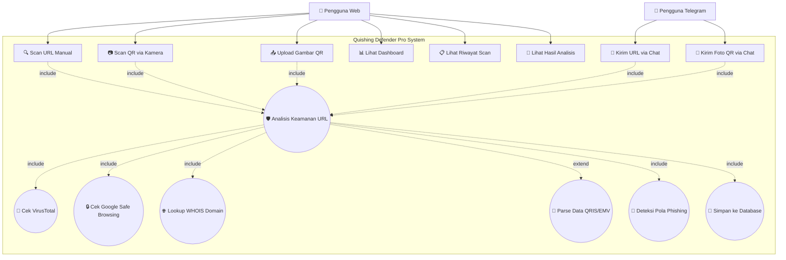
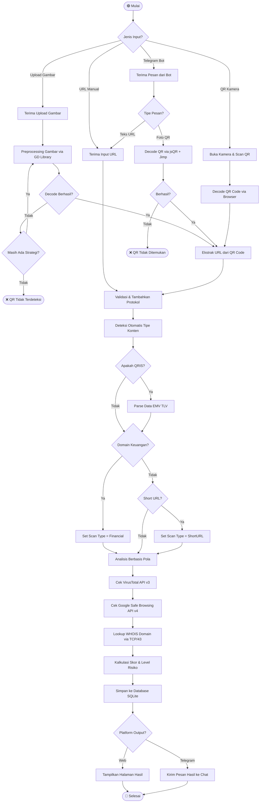
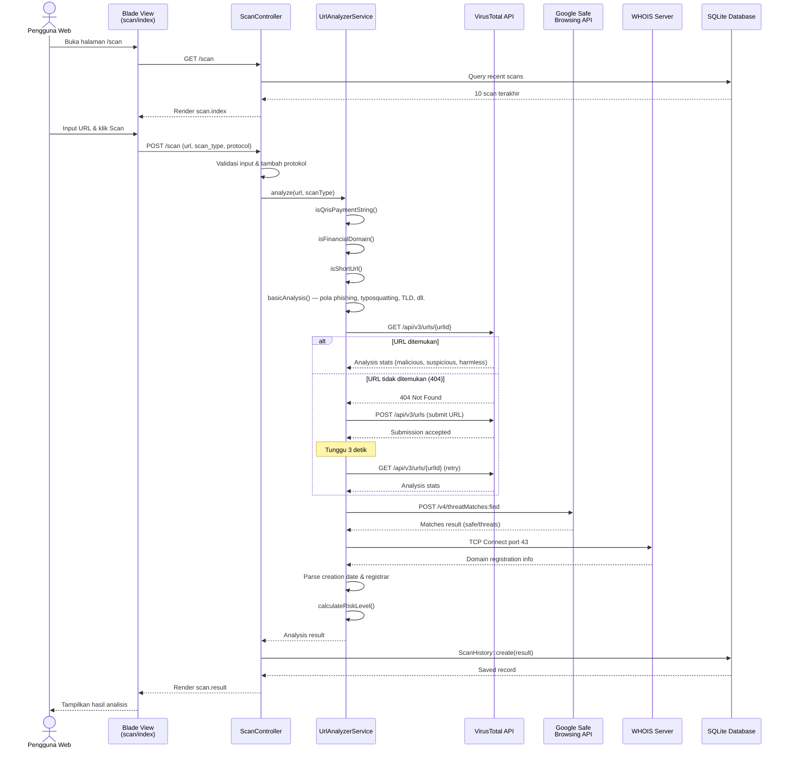
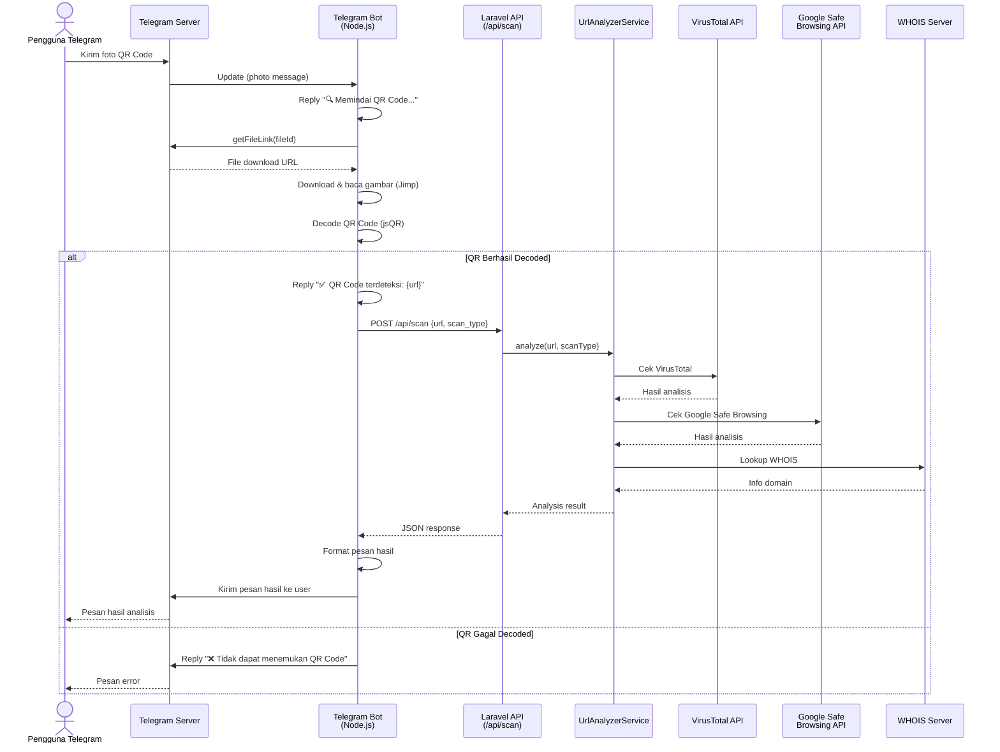
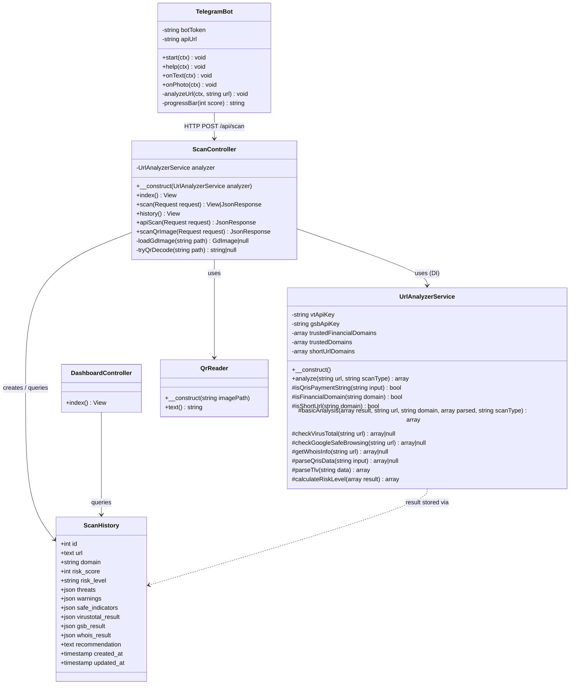
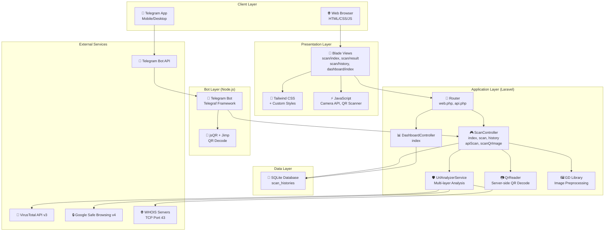
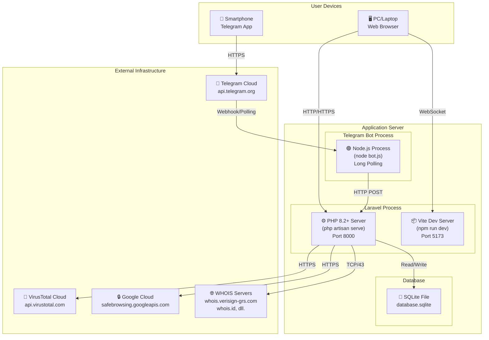

# 🛡️ Quishing Defender Pro

**Aplikasi Keamanan QR Code untuk Mendeteksi Phishing (Quishing) dan Malware**

Quishing Defender Pro adalah sebuah sistem keamanan siber berbasis web dan bot Telegram yang dirancang untuk mendeteksi dan mencegah serangan *quishing* (QR Code phishing). Aplikasi ini mengintegrasikan berbagai layanan keamanan seperti VirusTotal, Google Safe Browsing, dan WHOIS lookup untuk memberikan analisis risiko yang komprehensif terhadap URL dan QR Code yang dipindai.

---

## 📑 Daftar Isi

- [Metode Penelitian](#-metode-penelitian)
  - [Latar Belakang](#1-latar-belakang)
  - [Rumusan Masalah](#2-rumusan-masalah)
  - [Tujuan Penelitian](#3-tujuan-penelitian)
  - [Manfaat Penelitian](#4-manfaat-penelitian)
  - [Metode Pengembangan Sistem](#5-metode-pengembangan-sistem)
  - [Arsitektur Sistem](#6-arsitektur-sistem)
  - [Teknologi yang Digunakan](#7-teknologi-yang-digunakan)
  - [Alur Kerja Sistem](#8-alur-kerja-sistem)
  - [Mekanisme Analisis Keamanan](#9-mekanisme-analisis-keamanan)
  - [Pengujian Sistem](#10-pengujian-sistem)
- [Diagram UML](#-diagram-uml)
  - [Use Case Diagram](#1-use-case-diagram)
  - [Activity Diagram](#2-activity-diagram)
  - [Sequence Diagram](#3-sequence-diagram)
  - [Class Diagram](#4-class-diagram)
  - [Component Diagram](#5-component-diagram)
  - [Deployment Diagram](#6-deployment-diagram)
- [Daftar Pustaka](#-daftar-pustaka)
- [Saran untuk Laporan](#-saran-untuk-penyempurnaan-laporan)

---

## 📖 Metode Penelitian

### 1. Latar Belakang

Perkembangan teknologi informasi dan komunikasi telah membawa perubahan signifikan dalam berbagai aspek kehidupan, termasuk dalam cara manusia berinteraksi dan melakukan transaksi digital. Salah satu teknologi yang berkembang pesat dan digunakan secara luas adalah *Quick Response Code* (QR Code). QR Code telah diimplementasikan dalam berbagai domain, mulai dari pendidikan [3][7], sistem pembayaran digital seperti QRIS (Quick Response Code Indonesian Standard) [8], hingga pelacakan produk makanan [6].

Namun, di balik kemudahan penggunaan QR Code, terdapat ancaman keamanan siber yang semakin meningkat, yaitu **Quishing** (*QR Code Phishing*). Quishing merupakan bentuk serangan *social engineering* di mana penyerang menyisipkan URL berbahaya ke dalam QR Code untuk mengarahkan korban ke situs phishing, malware, atau halaman yang dirancang untuk mencuri informasi sensitif [2]. Serangan ini semakin canggih dengan penggunaan *fancy QR codes* dan teknik obfuskasi lainnya [1].

Di Indonesia, kejahatan siber dalam bentuk phishing telah menjadi permasalahan serius dan diatur dalam Undang-Undang Informasi dan Transaksi Elektronik (UU ITE) [5]. Dengan semakin masifnya penggunaan QR Code untuk pembayaran digital (QRIS), risiko serangan quishing menjadi semakin tinggi. Oleh karena itu, diperlukan manajemen keamanan siber yang komprehensif di era digital ini [9].

Berdasarkan latar belakang tersebut, penelitian ini mengembangkan **Quishing Defender Pro** — sebuah aplikasi keamanan yang mampu mendeteksi dan menganalisis potensi ancaman phishing pada QR Code dan URL. Aplikasi ini memanfaatkan integrasi multi-API (VirusTotal, Google Safe Browsing, WHOIS) serta algoritma deteksi berbasis pola untuk memberikan penilaian risiko yang akurat dan komprehensif.

### 2. Rumusan Masalah

Berdasarkan latar belakang yang telah diuraikan, rumusan masalah dalam penelitian ini adalah:

1. Bagaimana merancang dan membangun sistem deteksi *quishing* yang mampu menganalisis keamanan URL dan QR Code secara real-time?
2. Bagaimana mengintegrasikan layanan keamanan eksternal (VirusTotal, Google Safe Browsing, WHOIS) ke dalam satu platform analisis yang terpadu?
3. Bagaimana mendeteksi dan menganalisis berbagai jenis ancaman keamanan pada QR Code, termasuk QR Code yang mengandung data pembayaran QRIS?
4. Bagaimana menyediakan antarmuka yang mudah diakses oleh pengguna melalui platform web dan bot Telegram?

### 3. Tujuan Penelitian

Tujuan dari penelitian ini adalah:

1. **Membangun sistem deteksi quishing** yang mampu menganalisis keamanan URL dan QR Code secara real-time menggunakan pendekatan *multi-layered security analysis*.
2. **Mengintegrasikan multi-API keamanan** (VirusTotal, Google Safe Browsing, WHOIS) ke dalam satu platform terpadu untuk meningkatkan akurasi deteksi ancaman.
3. **Mengembangkan mekanisme deteksi khusus** untuk QR Code pembayaran QRIS, termasuk parsing data EMV (Europay, Mastercard, Visa) dan verifikasi informasi merchant.
4. **Menyediakan akses multi-platform** melalui antarmuka web berbasis Laravel dan bot Telegram untuk menjangkau pengguna secara lebih luas.
5. **Menerapkan analisis berbasis pola** (*pattern-based detection*) untuk mendeteksi teknik-teknik phishing seperti *typosquatting*, *URL spoofing*, dan penggunaan TLD mencurigakan.

### 4. Manfaat Penelitian

#### a. Manfaat Teoritis
- Memberikan kontribusi dalam bidang keamanan siber, khususnya deteksi serangan *quishing*.
- Menjadi referensi implementasi integrasi multi-API dalam sistem keamanan berbasis web.
- Menambah pemahaman tentang teknik-teknik deteksi phishing dan mekanisme analisis risiko URL.

#### b. Manfaat Praktis
- **Bagi Pengguna Umum**: Menyediakan alat yang mudah digunakan untuk memverifikasi keamanan QR Code dan URL sebelum mengaksesnya.
- **Bagi Pelaku Bisnis/UMKM**: Membantu memverifikasi keamanan QR Code pembayaran QRIS yang diterima.
- **Bagi Institusi/Organisasi**: Dapat digunakan sebagai alat bantu dalam program edukasi keamanan siber.

### 5. Metode Pengembangan Sistem

Penelitian ini menggunakan metode pengembangan sistem **Rapid Application Development (RAD)** yang terdiri dari empat tahapan utama:

#### a. Tahap Perencanaan Kebutuhan (*Requirements Planning*)

Pada tahap ini dilakukan identifikasi kebutuhan sistem melalui studi literatur dan analisis ancaman keamanan siber terkait QR Code. Kebutuhan fungsional yang diidentifikasi meliputi:

| No | Kebutuhan Fungsional | Deskripsi |
|----|---------------------|-----------|
| 1 | Pemindaian URL | Sistem dapat menerima input URL dan menganalisis keamanannya |
| 2 | Pemindaian QR Code via Kamera | Sistem dapat memindai QR Code melalui kamera perangkat secara real-time |
| 3 | Pemindaian QR Code via Upload | Sistem dapat memproses gambar QR Code yang diunggah dengan preprocessing |
| 4 | Analisis VirusTotal | Integrasi dengan API VirusTotal untuk pemindaian malware |
| 5 | Analisis Google Safe Browsing | Integrasi dengan API Google Safe Browsing untuk deteksi situs berbahaya |
| 6 | WHOIS Lookup | Pemeriksaan informasi registrasi domain untuk verifikasi usia domain |
| 7 | Deteksi QRIS/EMV | Parsing dan analisis data pembayaran QRIS dalam format EMV TLV |
| 8 | Analisis Pola Phishing | Deteksi pola-pola phishing, typosquatting, dan URL spoofing |
| 9 | Dashboard Statistik | Tampilan statistik hasil pemindaian (total scan, distribusi risiko) |
| 10 | Riwayat Pemindaian | Pencatatan dan tampilan riwayat pemindaian yang telah dilakukan |
| 11 | Bot Telegram | Integrasi dengan Telegram Bot untuk akses via messaging platform |
| 12 | Ekspor Laporan | Kemampuan menyalin URL dan berbagi hasil analisis |

#### b. Tahap Desain (*User Design*)

Pada tahap ini dilakukan perancangan arsitektur sistem, perancangan database, dan perancangan antarmuka pengguna. Perancangan dilakukan dengan menggunakan diagram UML (*Unified Modeling Language*) yang meliputi Use Case Diagram, Activity Diagram, Sequence Diagram, Class Diagram, Component Diagram, dan Deployment Diagram (lihat bagian [Diagram UML](#-diagram-uml)).

**Perancangan Database:**

Sistem menggunakan database SQLite dengan tabel utama `scan_histories` yang memiliki struktur sebagai berikut:

| Kolom | Tipe Data | Keterangan |
|-------|-----------|------------|
| `id` | INTEGER (PK) | Primary key, auto-increment |
| `url` | TEXT | URL yang dianalisis |
| `domain` | VARCHAR | Domain yang diekstrak dari URL |
| `risk_score` | INTEGER | Skor risiko (0-100) |
| `risk_level` | VARCHAR | Level risiko: SAFE, SUSPICIOUS, DANGEROUS |
| `threats` | JSON | Array ancaman yang terdeteksi |
| `warnings` | JSON | Array peringatan |
| `safe_indicators` | JSON | Array indikator keamanan |
| `virustotal_result` | JSON | Hasil analisis dari VirusTotal API |
| `gsb_result` | JSON | Hasil analisis dari Google Safe Browsing API |
| `whois_result` | JSON | Hasil lookup WHOIS domain |
| `recommendation` | TEXT | Rekomendasi keamanan untuk pengguna |
| `created_at` | TIMESTAMP | Waktu pencatatan |
| `updated_at` | TIMESTAMP | Waktu pembaruan |

#### c. Tahap Konstruksi (*Construction*)

Pada tahap ini dilakukan implementasi sistem menggunakan teknologi-teknologi berikut:

- **Backend**: Framework Laravel 12 (PHP 8.2+) dengan arsitektur MVC
- **Frontend**: Blade Templating Engine, Tailwind CSS, JavaScript
- **Telegram Bot**: Node.js dengan library Telegraf, jsQR, dan Jimp
- **Database**: SQLite
- **API Eksternal**: VirusTotal API v3, Google Safe Browsing API v4, WHOIS Protocol (TCP Port 43)

Implementasi dilakukan secara modular dengan memisahkan logika bisnis ke dalam Service Layer (`UrlAnalyzerService`), Controller Layer (`ScanController`, `DashboardController`), dan Model Layer (`ScanHistory`).

#### d. Tahap *Cutover* (Peralihan)

Pada tahap ini dilakukan pengujian sistem secara menyeluruh, meliputi pengujian fungsional, pengujian integrasi API, dan pengujian keamanan. Sistem kemudian di-deploy dan siap digunakan oleh pengguna.

### 6. Arsitektur Sistem

Aplikasi Quishing Defender Pro menggunakan arsitektur **client-server** dengan pendekatan **multi-tier architecture** yang terdiri dari:

```
┌──────────────────────────────────────────────────────────────────┐
│                        PRESENTATION TIER                         │
│  ┌─────────────────────┐     ┌─────────────────────────────┐    │
│  │   Web Interface     │     │     Telegram Bot Client      │    │
│  │ (Blade/Tailwind/JS) │     │   (Node.js + Telegraf)       │    │
│  └────────┬────────────┘     └──────────┬──────────────────┘    │
│           │ HTTP Request                │ HTTP POST (API)        │
└───────────┼─────────────────────────────┼───────────────────────┘
            │                             │
┌───────────┼─────────────────────────────┼───────────────────────┐
│           ▼          APPLICATION TIER    ▼                        │
│  ┌─────────────────────────────────────────────────────────┐    │
│  │              Laravel Framework (PHP 8.2+)               │    │
│  │  ┌──────────────┐  ┌──────────────────────────────┐    │    │
│  │  │  Controllers │  │     UrlAnalyzerService        │    │    │
│  │  │ (Scan, Dash) │──│  - basicAnalysis()            │    │    │
│  │  └──────────────┘  │  - checkVirusTotal()          │    │    │
│  │                    │  - checkGoogleSafeBrowsing()   │    │    │
│  │                    │  - getWhoisInfo()              │    │    │
│  │                    │  - parseQrisData()             │    │    │
│  │                    │  - calculateRiskLevel()        │    │    │
│  │                    └──────────────────────────────────┘    │    │
│  └─────────────────────────────────────────────────────────┘    │
└─────────────────────────────────────────────────────────────────┘
            │                             │
┌───────────┼─────────────────────────────┼───────────────────────┐
│           ▼          DATA TIER          ▼                        │
│  ┌──────────────┐  ┌────────────────────────────────────────┐   │
│  │   SQLite DB  │  │         External APIs                  │   │
│  │ (scan_hist.) │  │  - VirusTotal API v3                   │   │
│  └──────────────┘  │  - Google Safe Browsing API v4         │   │
│                    │  - WHOIS Protocol (TCP Port 43)         │   │
│                    └────────────────────────────────────────┘   │
└─────────────────────────────────────────────────────────────────┘
```

### 7. Teknologi yang Digunakan

| Komponen | Teknologi | Versi | Keterangan |
|----------|-----------|-------|------------|
| Backend Framework | Laravel | 12.x | Framework PHP untuk pengembangan web |
| Bahasa Backend | PHP | ≥ 8.2 | Server-side scripting language |
| Frontend | Blade + Tailwind CSS | - | Templating engine dan CSS framework |
| Telegram Bot | Node.js + Telegraf | 4.x | Framework bot Telegram |
| QR Decoder (Server) | khanamiryan/qrcode-detector-decoder | 2.x | Library PHP untuk decode QR Code |
| QR Decoder (Bot) | jsQR + Jimp | 1.4 / 0.22 | Library JS untuk decode QR Code |
| Database | SQLite | 3.x | Embedded relational database |
| API Keamanan 1 | VirusTotal API | v3 | API deteksi malware dan phishing |
| API Keamanan 2 | Google Safe Browsing API | v4 | API deteksi situs berbahaya Google |
| Protokol Jaringan | WHOIS | TCP/43 | Protokol lookup informasi domain |
| HTTP Client | Laravel HTTP (Guzzle) | - | HTTP client untuk API calls |
| Image Processing | PHP GD Library | - | Preprocessing gambar QR Code |
| Build Tool | Vite | - | Frontend build tool |

### 8. Alur Kerja Sistem

Sistem Quishing Defender Pro memiliki dua alur utama yang beroperasi secara paralel:

#### a. Alur via Web Interface

1. **Input**: Pengguna memasukkan URL secara manual atau memindai QR Code menggunakan kamera/upload gambar melalui halaman scan (`/scan`).
2. **Preprocessing (untuk upload gambar)**: Jika pengguna mengunggah gambar QR Code, sistem melakukan *image preprocessing* menggunakan PHP GD Library. Strategi preprocessing meliputi: grayscale, peningkatan kontras, sharpening, penyesuaian brightness, upscale 2x, negate, dan edge detection. Setiap strategi dicoba secara berurutan hingga QR Code berhasil di-decode oleh `QrReader`.
3. **Analisis**: `ScanController` meneruskan URL ke `UrlAnalyzerService` yang melakukan analisis multi-lapisan.
4. **Penyimpanan**: Hasil analisis disimpan ke tabel `scan_histories` di database SQLite.
5. **Output**: Hasil ditampilkan di halaman result (`/scan/result`) dengan detail ancaman, peringatan, indikator aman, dan rekomendasi.

#### b. Alur via Telegram Bot

1. **Input**: Pengguna mengirim URL (teks) atau foto QR Code ke bot Telegram.
2. **QR Decode (untuk foto)**: Bot mengunduh gambar, lalu mendekode menggunakan library jsQR dan Jimp.
3. **API Call**: Bot mengirim URL ke endpoint API Laravel (`/api/scan`) melalui HTTP POST.
4. **Analisis**: Server Laravel melakukan analisis yang sama seperti alur web.
5. **Output**: Hasil dikirim kembali ke pengguna Telegram dalam format pesan terstruktur yang menampilkan risk level, score, ancaman, peringatan, dan rekomendasi.

### 9. Mekanisme Analisis Keamanan

`UrlAnalyzerService` melakukan analisis keamanan melalui **lima lapisan pemeriksaan** (*multi-layered security analysis*):

#### Lapisan 1: Deteksi Otomatis Tipe Konten

Sistem secara otomatis mendeteksi tipe konten dari input yang diterima:
- **QRIS Payment**: Deteksi string yang dimulai dengan `000201` (Payload Format Indicator EMV) atau mengandung identifier QRIS.
- **Financial Domain**: Pencocokan terhadap daftar domain keuangan terpercaya (bank Indonesia, e-wallet, payment gateway).
- **Short URL**: Deteksi domain URL shortener seperti `bit.ly`, `s.id`, `tinyurl.com`, dll.

#### Lapisan 2: Analisis Berbasis Pola (*Pattern-Based Analysis*)

Pemeriksaan meliputi:
- **Typosquatting Detection**: Mendeteksi domain yang meniru situs populer (contoh: `g00gle.com`, `paypai.com`, `faceb00k.com`, `brl.co.id`).
- **Phishing Pattern Matching**: Mendeteksi pola URL phishing seperti `paypal.*login`, `bank.*verify`, `account.*suspend`.
- **Suspicious TLD Check**: Memeriksa penggunaan TLD yang sering disalahgunakan (`.tk`, `.ml`, `.ga`, `.xyz`, `.click`).
- **URL Spoofing**: Mendeteksi penggunaan karakter `@` dalam URL untuk teknik redirect berbahaya.
- **IP Address Host**: Memeriksa apakah URL menggunakan IP langsung alih-alih domain.
- **Subdomain Analysis**: Memeriksa jumlah subdomain yang berlebihan (konteks-aware untuk domain keuangan).
- **HTTPS Verification**: Memeriksa penggunaan enkripsi SSL/TLS.
- **URL Length Analysis**: Memeriksa panjang URL yang mencurigakan.

#### Lapisan 3: VirusTotal API Analysis

- Mengirim URL ke VirusTotal API v3 menggunakan URL-safe base64 encoding.
- Menerima hasil pemindaian dari puluhan engine antivirus.
- Jika URL belum pernah dianalisis (HTTP 404), sistem akan melakukan *submission* otomatis dan melakukan retry setelah 3 detik.
- Hasil: jumlah engine yang mendeteksi URL sebagai malicious, suspicious, harmless, dan undetected.

#### Lapisan 4: Google Safe Browsing API Analysis

- Mengirim URL ke Google Safe Browsing API v4 dengan konfigurasi 4 jenis ancaman: `MALWARE`, `SOCIAL_ENGINEERING`, `UNWANTED_SOFTWARE`, dan `POTENTIALLY_HARMFUL_APPLICATION`.
- Platform target: `ANY_PLATFORM`.
- Hasil: status aman/berbahaya beserta jenis ancaman yang terdeteksi.

#### Lapisan 5: WHOIS Domain Lookup

- Melakukan koneksi langsung ke server WHOIS melalui socket TCP port 43.
- Mendukung multiple TLD dengan server WHOIS spesifik (`.com`, `.net`, `.org`, `.id`, `.io`, dll.).
- Menerapkan logika penanganan domain Indonesia (`.co.id`, `.or.id`, `.go.id`, `.ac.id`).
- Mengekstrak tanggal registrasi dan informasi registrar.
- Memperhitungkan usia domain dalam kalkulasi risiko: < 30 hari (tinggi), < 180 hari (sedang), > 180 hari (aman).

#### Kalkulasi Skor Risiko

Skor risiko akhir dihitung berdasarkan akumulasi dari semua lapisan analisis:

| Skor Risiko | Level | Rekomendasi |
|-------------|-------|-------------|
| 0–25 | ✅ **SAFE** | URL terlihat aman, tetap waspada |
| 26–55 | ⚠️ **SUSPICIOUS** | URL mencurigakan, periksa detail lebih lanjut |
| 56–100 | 🚫 **DANGEROUS** | URL berbahaya, jangan buka link ini |

### 10. Pengujian Sistem

Pengujian dilakukan dengan skenario berikut:

| No | Skenario Pengujian | Input | Hasil yang Diharapkan |
|----|-------------------|-------|----------------------|
| 1 | URL aman (trusted domain) | `https://google.com` | SAFE, risk score rendah, indikator aman |
| 2 | URL phishing (domain mencurigakan) | `https://paypal-login.tk` | DANGEROUS, deteksi typosquatting + suspicious TLD |
| 3 | URL IP address langsung | `http://192.168.1.1` | SUSPICIOUS, peringatan penggunaan IP |
| 4 | URL dengan karakter @ | `https://bank.com@evil.com` | DANGEROUS, deteksi URL spoofing |
| 5 | QR Code QRIS valid | QR Code pembayaran QRIS | SAFE, informasi merchant ditampilkan |
| 6 | QR Code berisi URL phishing | QR Code menuju situs phishing | DANGEROUS, deteksi ancaman |
| 7 | Scan via Telegram Bot (URL) | Kirim URL ke bot | Hasil analisis dalam format Telegram |
| 8 | Scan via Telegram Bot (foto QR) | Kirim foto QR ke bot | QR di-decode, URL dianalisis |
| 9 | Upload gambar QR berkualitas rendah | Gambar buram/gelap | QR berhasil di-decode setelah preprocessing |
| 10 | Dashboard statistik | Akses `/dashboard` | Statistik total scan dan distribusi risiko |

---

## 📐 Diagram UML

### 1. Use Case Diagram

Use Case Diagram menggambarkan interaksi antara aktor (pengguna) dengan sistem. Terdapat dua aktor utama: **Pengguna Web** yang mengakses melalui browser, dan **Pengguna Telegram** yang mengakses melalui bot Telegram.



**Penjelasan:**
- **Pengguna Web** dapat melakukan 6 aksi utama: scan URL manual, scan QR via kamera, upload gambar QR, melihat dashboard statistik, melihat riwayat scan, dan melihat hasil analisis detail.
- **Pengguna Telegram** dapat melakukan 2 aksi: mengirim URL via chat dan mengirim foto QR Code via chat.
- Semua aksi scanning memiliki relasi **«include»** dengan use case "Analisis Keamanan URL", yang kemudian memiliki relasi **«include»** lagi dengan sub-proses pengecekan VirusTotal, Google Safe Browsing, WHOIS, deteksi pola phishing, dan penyimpanan ke database.
- Use case "Parse Data QRIS/EMV" memiliki relasi **«extend»** karena hanya dijalankan jika input terdeteksi sebagai data pembayaran QRIS.

---

### 2. Activity Diagram

Activity Diagram menggambarkan alur aktivitas lengkap dari proses pemindaian dan analisis URL/QR Code dalam sistem.



**Penjelasan:**
- Diagram ini menunjukkan **empat jalur masuk** yang mungkin: URL manual, scan kamera, upload gambar, dan Telegram Bot.
- Untuk upload gambar, terdapat **strategi preprocessing bertingkat** menggunakan PHP GD Library yang mencoba berbagai filter (grayscale, contrast, sharpening, dll.) secara berurutan hingga QR berhasil di-decode.
- Setelah URL diperoleh, sistem melakukan **deteksi otomatis tipe konten** (QRIS, Financial Domain, Short URL) sebelum memulai analisis multi-lapisan.
- Proses analisis berjalan **secara sekuensial** melalui 5 lapisan: deteksi tipe → analisis pola → VirusTotal → Google Safe Browsing → WHOIS → kalkulasi risiko.
- Hasil akhir disimpan ke database dan ditampilkan sesuai platform asal (web atau Telegram).

---

### 3. Sequence Diagram

Sequence Diagram menggambarkan urutan interaksi antar objek dalam proses analisis URL. Diagram ini menunjukkan dua skenario utama: scan via web dan scan via Telegram Bot.

#### a. Sequence Diagram — Scan via Web



#### b. Sequence Diagram — Scan via Telegram Bot



**Penjelasan:**
- **Sequence Diagram Web** menunjukkan alur komunikasi dari pengguna → View → Controller → Service → API Eksternal → Database, dan kembali ke pengguna. Terdapat alur alternatif (*alt*) pada VirusTotal API jika URL belum pernah dianalisis.
- **Sequence Diagram Telegram Bot** menunjukkan bagaimana bot bertindak sebagai *middleware* antara pengguna Telegram dan API Laravel. Bot melakukan decode QR Code secara lokal menggunakan jsQR, kemudian mengirim URL hasil decode ke endpoint API Laravel untuk dianalisis.
- Kedua diagram menunjukkan bahwa **logika analisis keamanan terpusat** di `UrlAnalyzerService`, memastikan konsistensi hasil analisis di semua platform.

---

### 4. Class Diagram

Class Diagram menggambarkan struktur kelas-kelas utama dalam sistem beserta atribut, method, dan relasi antar kelas.



**Penjelasan:**
- **ScanController**: Controller utama yang menangani semua interaksi pengguna terkait pemindaian. Memiliki dependency injection ke `UrlAnalyzerService` dan berinteraksi dengan model `ScanHistory` serta `QrReader` untuk decode QR server-side.
- **DashboardController**: Controller sederhana yang mengambil data statistik dari `ScanHistory` untuk ditampilkan di dashboard.
- **UrlAnalyzerService**: Service class yang berisi seluruh logika bisnis analisis keamanan. Memiliki atribut berupa API key dan daftar domain terpercaya. Method-method protected (`#`) melakukan tugas spesifik: cek VirusTotal, cek GSB, lookup WHOIS, parse QRIS, dan kalkulasi risiko.
- **ScanHistory**: Model Eloquent yang merepresentasikan tabel `scan_histories` di database. Menyimpan seluruh data hasil analisis dalam format JSON.
- **TelegramBot**: Komponen terpisah (Node.js) yang berkomunikasi dengan Laravel API melalui HTTP. Bertanggung jawab menerima pesan, decode QR, dan memformat hasil analisis.
- **QrReader**: Library eksternal untuk decode QR Code dari gambar di server-side.

---

### 5. Component Diagram

Component Diagram menggambarkan komponen-komponen arsitektural sistem dan bagaimana mereka saling terhubung.



**Penjelasan:**
- **Client Layer**: Browser web dan aplikasi Telegram sebagai titik akses pengguna.
- **Presentation Layer**: Blade views, Tailwind CSS, dan JavaScript (termasuk Camera API untuk scan QR) menangani rendering antarmuka web.
- **Application Layer (Laravel)**: Pusat logika aplikasi. Router mengarahkan request ke controller yang sesuai. `ScanController` menggunakan `UrlAnalyzerService` untuk analisis, `QrReader` dan `GD Library` untuk decode QR Code server-side.
- **Bot Layer (Node.js)**: Komponen terpisah yang berjalan sebagai proses Node.js. Berkomunikasi dengan Telegram API (menerima pesan) dan Laravel API (mengirim URL untuk dianalisis).
- **Data Layer**: SQLite database menyimpan riwayat scan.
- **External Services**: API keamanan eksternal (VirusTotal, GSB, WHOIS) dan Telegram Bot API.

---

### 6. Deployment Diagram

Deployment Diagram menggambarkan bagaimana komponen-komponen sistem dideploy pada infrastruktur fisik atau virtual.



**Penjelasan:**
- **User Devices**: Pengguna mengakses melalui browser (PC/Laptop) atau Telegram App (Smartphone).
- **Application Server**: Terdiri dari tiga proses utama yang berjalan secara bersamaan:
  - **PHP Server** (Laravel) berjalan di port 8000, menangani seluruh logika backend dan API.
  - **Vite Dev Server** berjalan di port 5173, menangani hot-reload untuk frontend development.
  - **Node.js Process** menjalankan bot Telegram dengan metode long polling.
- **Database**: SQLite sebagai file-based database (`database.sqlite`) yang diakses langsung oleh PHP Server.
- **External Infrastructure**: Server-server eksternal yang diakses melalui berbagai protokol (HTTPS untuk API, TCP/43 untuk WHOIS).
- Deployment lokal menggunakan `start-app.bat` untuk menjalankan kedua proses (Laravel + Bot) secara bersamaan.

---

## 📚 Daftar Pustaka

[1] Akram, M. W., Sood, K., Hassan, M. U., & Thiruvady, D. (2026). ALFA: a Safe-by-Design approach to mitigate quishing attacks launched via fancy QR codes. *ArXiv.org*. http://arxiv.org/abs/2601.06768

[2] Amoah, G. A., & JB, H. (2022). QR code security: Mitigating the issue of quishing (QR code phishing). *International Journal of Computer Applications, 184*(33), 34–39. https://doi.org/10.5120/ijca2022922425

[3] Durak, G., Ozkeskin, E. E., & Ataizi, M. (2016). QR Codes In Education And Communication. *Turkish Online Journal of Distance Education, 0*(0). https://doi.org/10.17718/tojde.89156

[4] Garateguy, G. J., Arce, G. R., Lau, D. L., & Villarreal, O. P. (2014). QR images: Optimized image embedding in QR codes. *IEEE Transactions on Image Processing, 23*(7), 2842–2853. https://doi.org/10.1109/tip.2014.2321501

[5] Gulo, A. S., Lasmadi, S., & Nawawi, K. (2021). Cyber Crime dalam Bentuk Phising Berdasarkan Undang-Undang Informasi dan Transaksi Elektronik. *PAMPAS Journal of Criminal Law, 1*(2), 68–81. https://doi.org/10.22437/pampas.v1i2.9574

[6] Kim, Y. G., & Woo, E. (2016). Consumer acceptance of a quick response (QR) code for the food traceability system: Application of an extended technology acceptance model (TAM). *Food Research International, 85*, 266–272. https://doi.org/10.1016/j.foodres.2016.05.002

[7] Law, C., & So, S. (2010). QR codes in education. *Journal of Educational Technology Development and Exchange, 3*(1). https://doi.org/10.18785/jetde.0301.07

[8] Salam, A., & Bhaskoro, S. B. (2021). Sistem Keamanan Cerdas pada Kunci Pintu Otomatis menggunakan Kode QR. *CYBERNETICS, 5*(01). https://doi.org/10.29406/cbn.v5i01.2307

[9] Susanto, E., Antira, L., Kevin, K., Stanzah, E., & Majid, A. A. (2023). Manajemen Keamanan Cyber di Era Digital. *Journal of Business and Entrepreneurship, 11*(1), 23. https://doi.org/10.46273/jobe.v11i1.365

---

## 💡 Saran untuk Penyempurnaan Laporan

Berikut adalah beberapa saran agar laporan proyek dapat dibuat sesempurna mungkin:

### 📝 Saran Konten dan Struktur

1. **Tambahkan Bab Tinjauan Pustaka yang Lebih Dalam**
   - Bahas secara detail setiap referensi dan kaitannya dengan proyek. Misalnya, jelaskan bagaimana pendekatan ALFA dari Akram et al. [1] menginspirasi arsitektur multi-layer detection pada sistem Anda.
   - Buat *literature mapping table* yang menunjukkan kontribusi setiap referensi terhadap proyek.

2. **Tambahkan Perbandingan dengan Sistem Serupa**
   - Bandingkan fitur Quishing Defender Pro dengan tools serupa yang sudah ada (seperti URLVoid, PhishTank, dll).
   - Buat tabel perbandingan fitur untuk menunjukkan keunggulan sistem yang dikembangkan.

3. **Tambahkan Data Hasil Pengujian yang Lebih Kuantitatif**
   - Lakukan pengujian dengan dataset URL phishing yang lebih besar (misalnya dari PhishTank atau OpenPhish).
   - Hitung metrik akurasi: *True Positive Rate*, *False Positive Rate*, *Precision*, *Recall*, dan *F1-Score*.
   - Tampilkan hasil dalam bentuk *confusion matrix*.

4. **Sertakan Screenshot Aplikasi**
   - Tambahkan tangkapan layar dari setiap halaman utama: halaman scan, halaman hasil, dashboard, riwayat, dan bot Telegram.
   - Gunakan *mockup* perangkat (browser/smartphone) untuk presentasi yang lebih profesional.

### 🔧 Saran Teknis

5. **Dokumentasikan Konfigurasi API**
   - Jelaskan langkah-langkah detail mendapatkan API key dari VirusTotal dan Google Safe Browsing.
   - Sertakan contoh file `.env` (tanpa API key asli).

6. **Tambahkan Flowchart Algoritma Risk Scoring**
   - Buat flowchart khusus yang menjelaskan bagaimana skor risiko dihitung dari setiap lapisan analisis.
   - Jelaskan bobot (weight) dari masing-masing indikator.

7. **Tambahkan Diagram Entity-Relationship (ERD)**
   - Meskipun saat ini hanya ada 1 tabel, sertakan ERD untuk menunjukkan potensi ekspansi database (misalnya tabel users, api_keys, blocked_urls).

### 📊 Saran Format dan Presentasi

8. **Gunakan Format Penomoran yang Konsisten**
   - Pastikan semua bab, sub-bab, tabel, dan gambar menggunakan penomoran yang konsisten (contoh: Tabel 3.1, Gambar 4.2).

9. **Tambahkan Glosarium**
   - Buat daftar istilah teknis (Quishing, Phishing, EMV, TLV, QRIS, Typosquatting, dll.) dengan definisinya.

10. **Tambahkan Lampiran**
    - Sertakan *source code* utama (Service, Controller, Bot) di bagian lampiran.
    - Sertakan contoh output JSON dari API (VirusTotal response, GSB response).

11. **Proofread dengan Teliti**
    - Pastikan konsistensi penggunaan bahasa (Bahasa Indonesia/Inggris).
    - Periksa ejaan dan tata bahasa sesuai PUEBI.
    - Pastikan setiap gambar/tabel dirujuk dalam teks narasi.

### 🚀 Saran Pengembangan Lebih Lanjut

12. **Tambahkan Fitur Machine Learning**
    - Integrasikan model ML untuk klasifikasi URL phishing berdasarkan fitur-fitur URL (panjang, jumlah subdomain, entropi karakter, dll.).
    - Ini bisa menjadi saran pengembangan di bab penutup.

13. **Implementasikan Rate Limiting dan Anti-Abuse**
    - Dokumentasikan mekanisme perlindungan terhadap penyalahgunaan API.

14. **Tambahkan Unit Testing**
    - Tulis unit test untuk `UrlAnalyzerService` dan dokumentasikan *code coverage*.

---

## 📦 Instalasi & Menjalankan Aplikasi

### Prasyarat
- PHP ≥ 8.2 dengan ekstensi GD
- Composer
- Node.js ≥ 18
- NPM

### Langkah Instalasi

```bash
# 1. Clone repository
git clone <repo-url>
cd "Project UAS"

# 2. Setup Laravel
cd quishing-laravel
composer install
cp .env.example .env
php artisan key:generate
php artisan migrate
npm install
npm run build

# 3. Setup Telegram Bot
cd ../telegram_bot
npm install
cp .env.example .env
# Edit .env, isi TELEGRAM_BOT_TOKEN dan API_URL
```

### Menjalankan

```bash
# Cara 1: Menggunakan Control Panel
start-app.bat

# Cara 2: Manual
# Terminal 1 - Laravel
cd quishing-laravel
php artisan serve

# Terminal 2 - Telegram Bot
cd telegram_bot
node bot.js
```

### Konfigurasi API Keys

Edit file `quishing-laravel/.env`:
```env
VIRUSTOTAL_API_KEY=your_virustotal_api_key
GOOGLE_SAFE_BROWSING_KEY=your_gsb_api_key
```

---

## 📄 Lisensi

Proyek ini dikembangkan untuk keperluan akademis — Mata Kuliah Pemrograman Jaringan.
